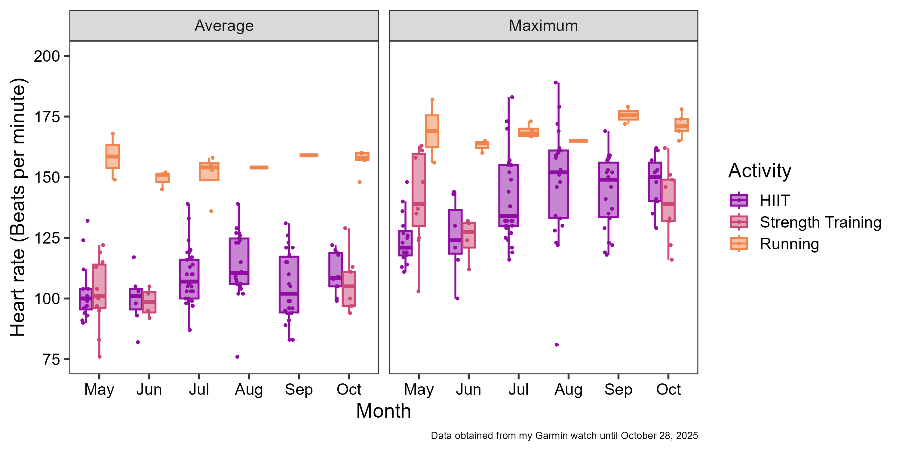
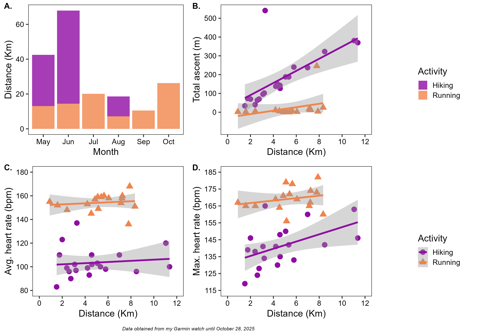

# **EVR 628 Assignments and more :)**

**Author:** Lina Aragón [linamaragonb\@gmail.com](mailto:linamaragonb@gmail.com){.email}

This repository has been created as part of the EVR 628 course (Introduction to Data Management and Visualization for Environmental Scientists) from the University of Miami. Here, I will upload my unique solutions for the assignments Dr. Juan Carlos Villaseñor-Derbez (JC) designed.

## **First assignment**

The first assignment was to create this repository. So, Voila :) !!

When creating the project, I used the "EVR628tools" package designed by Dr. Villaseñor-Derbez to make the project structure that will contain everything I will do to achieve each assignment's goal. I used the function create_dirs(), and with this one, I gave the repository the following structure:

-   `data`:

    -   `data/raw`:
    -   `data/processed`:

-   `scripts`:

    -   `scripts/01_processing`:
    -   `scripts/02_analyses`:
    -   `scripts/03_contents`: contains a single file showing the code to create this structure

-   `results`:

    -   `results/img`:
    -   `results/tab`:

The subfolder 03_processing, inside the scripts folder, contains the .qmd file showing the few steps I took for the first assignment.

## **Second assignment**

The second assignment is a bit more fun and interesting than the first one. For this one, we should find a messy dataset and shape it so that we are ready to analyze data and make figures.

I wanted to do something unrelated to my plant ecologist science hat. I have been working a lot analyzing pretty awesome data, so taking a break from that sounded like a great idea. Inspired by one of Dr. Villaseñor-Derbez's suggestions, I decided to download the data my Garmin Venu 3S has been collecting since May 9, 2025. You can find what I did in this [script](scripts/01_processing/clean_garmin_dataset.R).

### **About the data**

[***data/processed/garmin_processed.rds***](data/processed/garmin_processed.rds) ***contains 194 activities (rows) and 45 columns. I won't describe the 42 columns, so below are the ones I think will be useful for future analyses.***

-   `activity_type` - Character - A unique identifier for each type of activity (i.e., Strenght training, HIIT, Running, among others)
-   `date` - Date - A unique identifier for each activity's date and time
-   `star_time` - Period - Time of day the activity started
-   `month` - Numerical - The month in which the activity happened in digit format
-   `month_abbr` - Character - The month in which the activity happened in letter format ordered
-   `day` - Integer - The day in which the activity happened
-   `year` - Character - The year in which the activity happened
-   `specific_info` - Character - A unique identifier for specific information regarding the activity (i.e., place (Coral_Gables))
-   `distance` - Numerical - A distance metric for activities like running, walking and hiking
-   `distance` - Numerical - The calories burned during the activity
-   `time` - Time - The time I spent doing each activity
-   `avg_hr` - Numerical - Average HR during the activity
-   `max_hr` - Numerical - Maximum HR during the activity
-   `avg_hr` - Numerical - Average HR during the activity
-   `avg_speed` - Numerical - Average speed during the activity
-   `max_speed` - Numerical - Average speed during the activity
-   `total_ascent` - Numerical - Total ascent during the activity
-   `total_descent` - Numerical - Total descent during the activity
-   `avg_stride_length` - Numerical - Average stride during the activity
-   `avg_vertical_ratio` - Numerical - Average vertical ratio during the activity
-   `avg_vertical_oscillation` - Numerical - Average vertical oscillation during the activity
-   `avg__length` - Numerical - Average stride during the activity
-   `avg__ground_contact_time` - Numerical - Average ground contact time during the activity
-   `avg__power` - Numerical - Average power during the activity
-   `max__power` - Numerical - Max power during the activity
-   `steps` - Numerical - Steps taken during the activity
-   `total_reps` - Numerical - Total repetitions during the activity
-   `total_sets` - Numerical - Total sets during the activity
-   `body_battery_drain` - Numerical - How much the activity drained my energy
-   `best_lap_time` - Time - Best lap during the activity
-   `number_of_laps` - Numerical - Number of laps during the activity
-   `moving_time` - Time - Amount of time I move during the activity
-   `elapsed_time` - Time - Elapsed time during the activity
-   `min_elevation` - Numerical - Min elevation during the activity
-   `max_elevation` - Numerical - Max elevation during the activity

## **Third assignment**

For this assignment, Dr. JC asked us to visualize the data from the dataset we cleaned for assignment 2. Before working on this new assignment, I first downloaded my most recent data and then modified some lines of my clean_garmin_dataset.R code to utilize the "lubridate" package for handling dates and times.

I was first interested in the differences between my average and maximum heart rates during High Intensity Interval Training (HIIT), running and strength training activities. Therefore, I transformed my table into a long one to have a column for the type of summary statistic used (mean vs max) and another column for the heart rate value. Afterward, I plotted my average and maximum heart rate for each activity over the months I have had my watch. I used facet_wrap to show the difference between Average and Maximum heart rates.
Here is my visualization: 

I was also interested in my hiking and running endeavors. So, I decided to visualize the distance (Km) covered while running and hiking for each month of the year, and also study the relationship between the distance (Km) I covered and my total ascent (m), average hear rate (bpm), and maximum heart rate (bpm). I created each plot invidually. I extracted the legends for plot A and plot D using the get_legend function. I created a plot text for the caption. And, finally I used the plot_grid multiple times to be able to create the final visualization.
Here is my visualization: 

