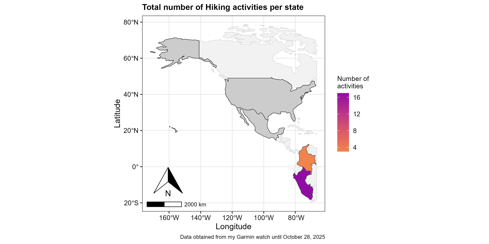
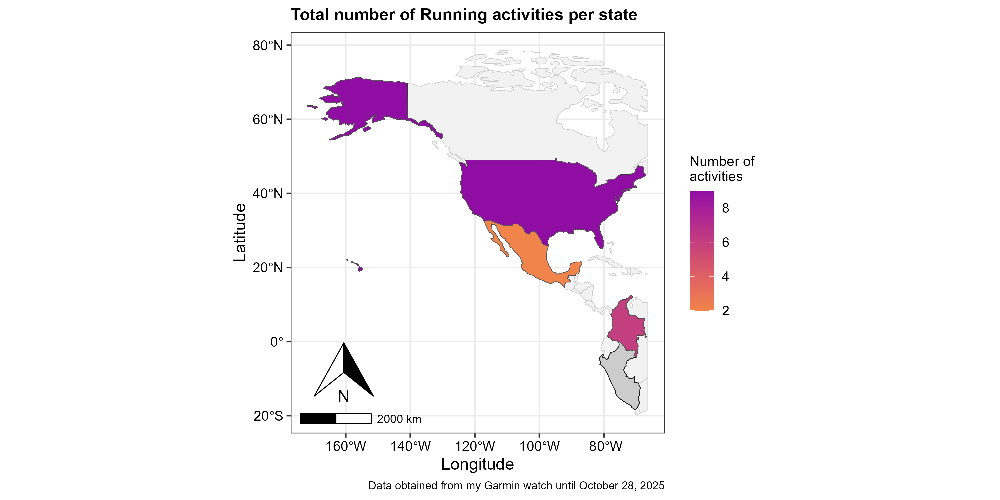
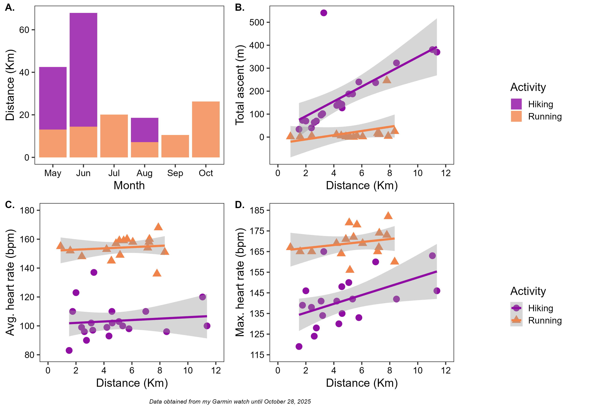
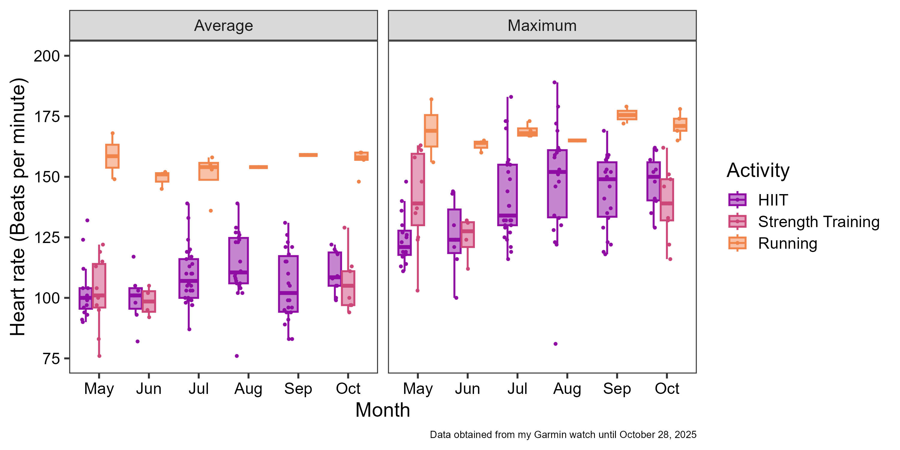

## Introduction {.smaller}
* Smartwaches have been transformed into advanced health monitoring devices [@kohler2024value; @kapogianni2025using]. 

* Its multiple sensors allow them to monitor continuously multiple vital signs:
  + Heart rate
  + Heart rate variability (HRV)
  + Respiratory rate 
  + Blood oxygen saturation
  + Stress levels
  + Sleep quality 

* Additionally, they allow users to track and measure their performance during running, cycling,
hiking, and multiple different activities.

## Objectives {.smaller}

This project had two main objectives:

1. Visualize the number of activities (i.e., runs and/or hikes) I have done in different countries during 2025.

2. Compare my vital sign (i.e, heart rate) and performance (i.e, distance, total ascent) during my running and hiking activities.

3. Compare my average and maximum heart rate during my my High Intensity Interval Training (HIIT), running and strength training activities.

## Data Sources and Processing {.smaller}

I own a Garmin Venu 3S. So, I analyzed the data collected by this specific model. Garmin® connect is the app designed by Garmin for users to access their data.

Fortunately, Garmin® creates a pretty decent table. I sill fixed a few things:

* Edited the "Tile" column to be able to access specific information (i.e., location) of hiking and running activities 

* Use the lubridate package to access information from the date column  

* Ensure that all the metrics columns were stored as numeric

## My data {.smaller}

Here you can see my garmin data table with 205 activities (rows) and 45 variables (cols) 

```{r}
library(knitr)
library(tidyverse)
library(reactable)

activities <- read_rds("data/processed/garmin_processed_20251028.rds")

reactable(
  activities,
  compact = TRUE,
  searchable = TRUE,
  defaultPageSize = 100,
  resizable = TRUE,
  style = "font-size:11px; line-height:1.1; padding:4px;")
```

## My Findings Objective 1 {.smaller}

This year, I had the amazing opportunity to visit different cities in America. Thus, I wanted to visualize the activities I did in those cities. 

:::: {.columns}
::: {.column style="font-size:25px; line-height:2;"}
In some cities, I hike a lot to be able to study plant species living in extreme environments. Specifically, I visited the highlands in the Colombian Andes Mountains, and the Amazon Rainforest in Perú. 
{.lightbox}
:::

::: {.column style="font-size:25px; line-height:2;"}
In other cities, I ran. I am an amateur runner, and my birthday gifts from me to me were my Garmin watch and my running shoes. So, I decided to also have a map of my running endeavors.
{.lightbox}
:::

::::


## My Findings Objective 2 {.smaller}

I also wanted to see how my vital sign (i.e, heart rate) and performance (i.e, distance, total ascent) compared while running and hiking.

{fig-align="center" width=75% .lightbox}

## My Findings Objective 3 {.smaller}

Finally, I wanted to compare my average and maximum heart rate while doing different types of training activities 

{fig-align="center" width=80% .lightbox}

## References


